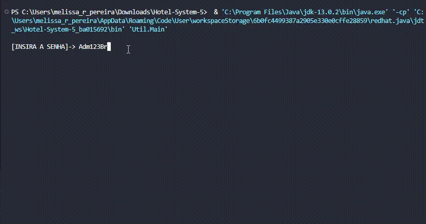

<div align="center">
  <span>
    
  </span>
</div>

<div align="center">

## **Projeto Avaliativo – Prova Prática de Programação Orientada a Objetos**

Este sistema foi desenvolvido para gerenciar um hotel, permitindo o cadastro de hóspedes, quartos, reservas e serviços, utilizando Java com JDBC para integração ao banco de dados MySQL.


</div>


---

<br>

## 📖 Funcionalidades

<div align="center">

  <table>
    <tr>
      <td width="50%">
        
      </td>
    <td width="50%">

  | Categoria | Funcionalidade |
  |-----------|-----------------|
  | Cadastro  | ➕ Hóspede • Quarto • Reserva |
  | Listagem  | 📋 Hóspedes • Quartos • Reservas |
  | Pesquisa  | 🔍 Hóspede • Quarto • Reserva |
  | Edição    | ✏ Editar Hóspede • ❌ Cancelar Reserva |
  | Sistema   | 🚪 Sair |

  </td>
</tr>
</table>

</div>

---

## 🛠 Estrutura do Projeto

```text
src/
├── model/       # Classes de modelo (Hóspede, Quarto, Reserva, Serviço, Pessoa)
├── dao/         # Classes de acesso ao banco (JDBC: CRUD com SQL)
├── service/     # Regras de negócio (validações, lógica)
├── view/        # Interface de interação com o usuário (menus)
└── Main.java    # Ponto de entrada do sistema
```

---

## 💻 Tecnologias Utilizadas

<div align="left">
  <br>
  
  
</div>

## 📂 Classes Principais

- **Pessoa** (classe abstrata) → atributos e métodos comuns  
- **Hóspede** → herda de Pessoa e representa o cliente  
- **Quarto** → dados sobre cada quarto disponível no hotel  
- **Reserva** → ligação entre Hóspede, Quarto e Serviço  
- **Serviço** → serviços adicionais (café da manhã, lavanderia, etc.)  
- **DAO** → classes responsáveis pelo CRUD no banco de dados via JDBC  

<br> 

<div align="left">
  
***💡 Dica: Além desta versão principal, você também pode conferir as outras versões disponíveis! 🐧***

</div>

----

<div align="center">

### **Melissa R. Pereira**  
✉️ [melissa_r_pereira@estudante.sesisenai.org.br](mailto:melissa_r_pereira@estudante.sesisenai.org.br)  


### **Gabrielli V. Glowatski**  
✉️ [gabrielli_glowatski@estudante.sesisenai.org.br](mailto:gabrielli_glowatski@estudante.sesisenai.org.br)  

</div>

